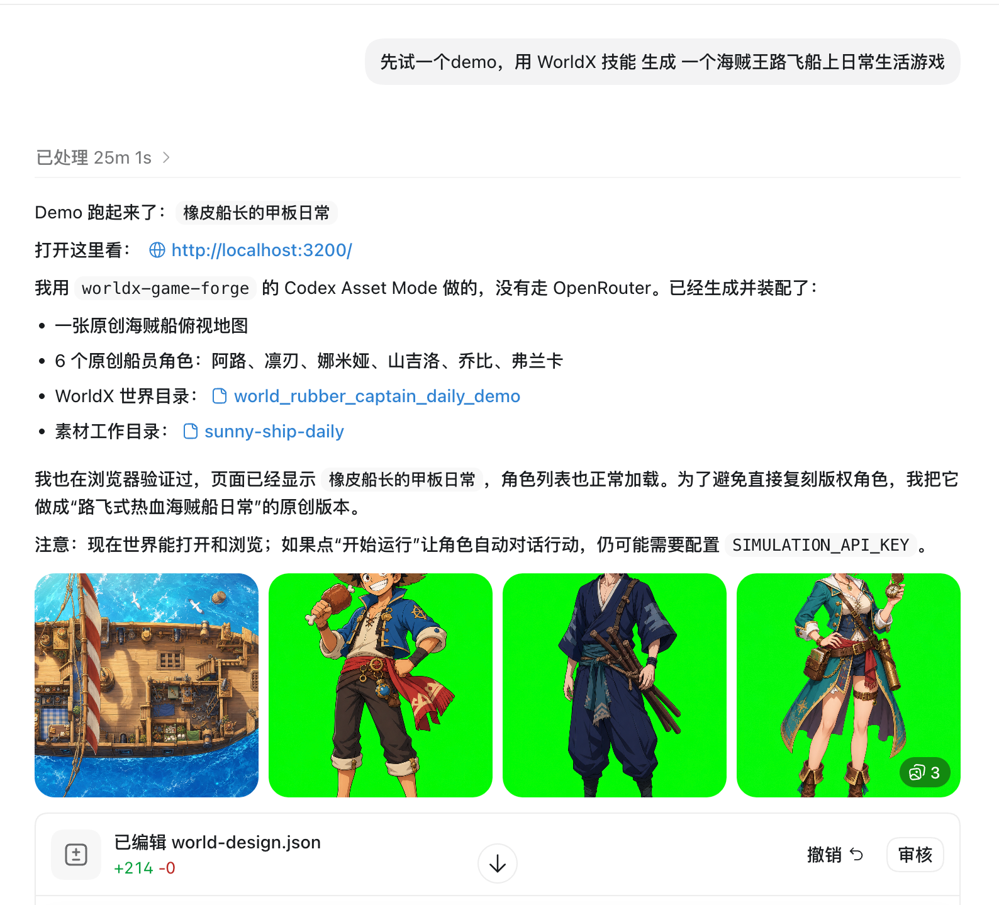

# WorldX Agent Forge

WorldX Agent Forge 是一个自包含的 Codex Skill。你可以在 Codex 里用一句话描述一个游戏世界，Codex 会生成世界设定、地图图片、角色图片，并把这些素材装配成一个可以在本地运行的 WorldX 互动模拟世界。

这个项目内置了 WorldX 运行时，所以用户安装 skill 后不需要再单独下载 WorldX 项目。




## 项目介绍

WorldX Agent Forge 的目标是把 Codex 变成一个“一句话生成 WorldX 游戏世界”的 agent。

它包含：

- `SKILL.md`：告诉 Codex 什么时候使用这个 skill，以及如何生成和装配世界。
- `scripts/`：启动、诊断、素材处理、WorldX 世界装配脚本。
- `assets/worldx-runtime/`：内置的 WorldX 开源运行时。
- `references/`：WorldX 路径、接口、排错说明。

标准流程是：

1. 用户在 Codex 里描述一个世界。
2. Codex 写出 `world-design.json`。
3. Codex 用内置图片生成能力生成地图和角色素材。
4. 脚本把素材装配成 WorldX 世界目录。
5. 内置 WorldX app 在本地启动，访问 `http://localhost:3200/` 即可游玩和查看。

## 基于 WorldX 开源项目

本项目内置并适配了开源项目 [YGYOOO/WorldX](https://github.com/YGYOOO/WorldX)。

WorldX 提供核心运行能力：

- 前端世界查看器
- 后端模拟服务
- 世界和时间线加载
- 角色状态与事件系统
- 地图、角色、场景配置格式

WorldX Agent Forge 在 WorldX 之上增加：

- Codex Skill 工作流
- Codex Asset Mode
- Codex 生成素材后的本地装配流程
- 启动、诊断、恢复脚本
- 自包含 runtime，用户无需额外 clone WorldX

内置 WorldX 代码位于：

```text
assets/worldx-runtime/
```

WorldX 原始许可证位于：

```text
assets/worldx-runtime/LICENSE
```

请在二次分发或修改时保留 WorldX 的 MIT License 声明。

## 安装方法

把仓库 clone 到 Codex skills 目录：

```bash
mkdir -p "${CODEX_HOME:-$HOME/.codex}/skills"
git clone git@github.com:HuangLittleOrange/worldx-agent-forge.git \
  "${CODEX_HOME:-$HOME/.codex}/skills/worldx-agent-forge"
```

如果你没有配置 GitHub SSH，也可以用 HTTPS：

```bash
mkdir -p "${CODEX_HOME:-$HOME/.codex}/skills"
git clone https://github.com/HuangLittleOrange/worldx-agent-forge.git \
  "${CODEX_HOME:-$HOME/.codex}/skills/worldx-agent-forge"
```

安装后重启 Codex，让 Codex 重新发现 skill。

## 怎样使用

重启 Codex 后，在对话里直接提到：

```text
$worldx-agent-forge
```

示例：

```text
用 $worldx-agent-forge 生成一个核战后超市，六个幸存者被困在里面。
使用 Codex Asset Mode，不要用 OpenRouter。
```

或者：

```text
用 $worldx-agent-forge 生成一个海贼船上的日常生活模拟游戏。
角色和画面使用原创设定，不要直接复刻已有版权角色。
```

Codex 会自动完成：

1. 设计世界规则、角色、地点、互动元素。
2. 生成地图图片。
3. 生成角色图片。
4. 把图片装配成 WorldX 需要的地图和角色 sprite sheet。
5. 创建新的 WorldX 世界。
6. 启动本地 WorldX app。
7. 打开或提示你访问：

```text
http://localhost:3200/
```

## 第一次运行会发生什么

第一次启动时，skill 会在内置 WorldX runtime 中自动安装依赖：

```bash
npm install
```

依赖会安装在：

```text
assets/worldx-runtime/node_modules/
assets/worldx-runtime/client/node_modules/
assets/worldx-runtime/server/node_modules/
assets/worldx-runtime/orchestrator/node_modules/
assets/worldx-runtime/generators/node_modules/
```

这些目录已被 `.gitignore` 忽略，不会提交到仓库。

## 常用命令

你通常不需要手动运行这些命令，Codex 会按 skill 流程调用它们。排错时可以手动执行。

自检：

```bash
node "${CODEX_HOME:-$HOME/.codex}/skills/worldx-agent-forge/scripts/self_test.mjs"
```

启动 WorldX：

```bash
node "${CODEX_HOME:-$HOME/.codex}/skills/worldx-agent-forge/scripts/worldx.mjs" start
```

查看状态：

```bash
node "${CODEX_HOME:-$HOME/.codex}/skills/worldx-agent-forge/scripts/worldx.mjs" status
```

停止 WorldX：

```bash
node "${CODEX_HOME:-$HOME/.codex}/skills/worldx-agent-forge/scripts/worldx.mjs" stop
```

诊断配置和端口：

```bash
node "${CODEX_HOME:-$HOME/.codex}/skills/worldx-agent-forge/scripts/worldx.mjs" diagnose
```

手动装配 Codex 生成的素材：

```bash
node "${CODEX_HOME:-$HOME/.codex}/skills/worldx-agent-forge/scripts/worldx.mjs" assemble-codex \
  --design /path/to/world-design.json \
  --map /path/to/map.png \
  --chars-dir /path/to/character-pngs \
  --prompt "original user prompt"
```

## 是否需要 API Key

使用推荐的 Codex Asset Mode 时，不需要配置 OpenRouter 或第三方图片模型 API key。

Codex Asset Mode 使用：

- Codex 自己生成世界设定
- Codex 内置图片生成能力生成地图和角色图
- 本地脚本处理图片、sprite sheet 和 WorldX 世界目录

不过，如果你想在 WorldX 里点击“开始运行”，让角色持续自动决策、对话和产生记忆，WorldX runtime 仍可能需要一个文本模型配置：

```env
SIMULATION_BASE_URL=
SIMULATION_API_KEY=
SIMULATION_MODEL=
```

如果你使用 WorldX 原始的 legacy provider pipeline，也就是直接调用：

```bash
node "${CODEX_HOME:-$HOME/.codex}/skills/worldx-agent-forge/scripts/worldx.mjs" create "..."
```

则需要配置：

```env
ORCHESTRATOR_BASE_URL=
ORCHESTRATOR_API_KEY=
ORCHESTRATOR_MODEL=

IMAGE_GEN_PROVIDER=
IMAGE_GEN_BASE_URL=
IMAGE_GEN_API_KEY=
IMAGE_GEN_MODEL=

VISION_BASE_URL=
VISION_API_KEY=
VISION_MODEL=
```

一般用户建议始终使用 Codex Asset Mode。

## 目录结构

```text
worldx-agent-forge/
├── README.md
├── SKILL.md
├── agents/
│   └── openai.yaml
├── assets/
│   └── worldx-runtime/       # 内置 WorldX 开源运行时
├── docs/
│   └── images/               # README 示例截图
├── references/
│   └── worldx.md
└── scripts/
    ├── assemble_codex_world.mjs
    ├── prepare_codex_assets.py
    ├── self_test.mjs
    └── worldx.mjs
```

## 更新

进入 skill 目录后拉取最新版本：

```bash
cd "${CODEX_HOME:-$HOME/.codex}/skills/worldx-agent-forge"
git pull
```

如果 Codex 已经打开，更新后建议重启 Codex。

## English Summary

WorldX Agent Forge is a self-contained Codex skill that turns a natural-language prompt into a runnable local WorldX simulation world.

It bundles and adapts the open-source [YGYOOO/WorldX](https://github.com/YGYOOO/WorldX) runtime under `assets/worldx-runtime/`, then adds a Codex-first asset generation and assembly workflow around it.

Recommended usage:

```text
Use $worldx-agent-forge to generate a fantasy ship daily-life simulation game.
Use Codex Asset Mode.
```

Codex Asset Mode does not require OpenRouter or third-party image-generation API keys. Runtime character simulation may still require `SIMULATION_*` model settings if you want characters to continuously act and talk after the world is loaded.
